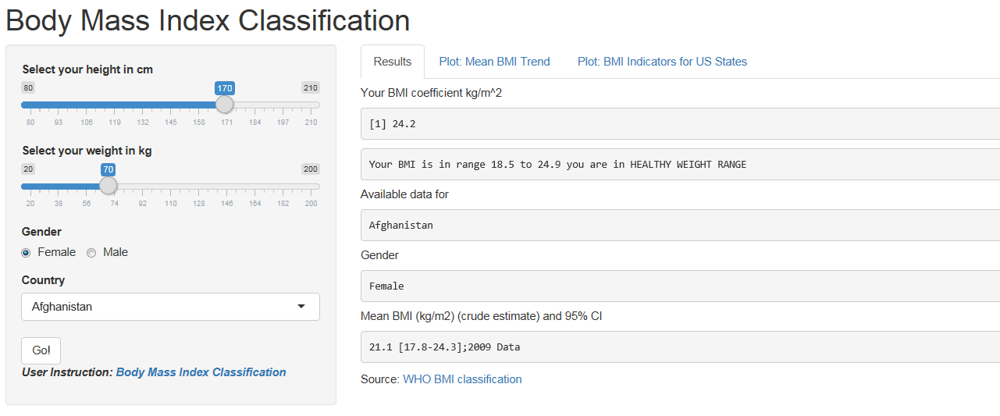

## Introduction

Body Mass Index (BMI) is a simple index of weight-for-height that is commonly used to classify underweight, overweight and obesity in adults. It is defined as the weight in kilograms divided by the square of the height in metres (kg/m2).

# Key Facts:

1. Worldwide obesity has nearly doubled since 1980.
2. In 2008, more than 1.4 billion adults, 20 and older, were overweight. Of these over 200 million men and nearly 300 million women were obese.
3. 35% of adults aged 20 and over were overweight in 2008, and 11% were obese.
4. 65% of the world's population live in countries where overweight and obesity kills more people than underweight. More than 40 million children under the age of 5 were overweight or obese in 2012.

--- .class #1

## Body Mass Index Classification BMI-C Application

Following is the screen shoot from the application
<div style='text-align: center;'>
    
</div>

In order to access the App of BMI-C [click here]

[click here]: <https://tkeshfa.shinyapps.io/BMI-Classification>

--- .class #2

## Instrcution on using the BMI-C

The user is required to enter height in centimeters and weight in kilograms.
For measurments in Imperial Units please use following conversions:

> 1 Foot [ft.] = 30.48 Centimeters [cm.] 

> 1 Inch [in.] = 2.54 Centimeters [cm.]

> 1 Pound [lbs.] = 0.4536 Kilograms [kg.]

> 1 Stone [st.] = 6.35 Kilograms [kg.]

Then Press "Go!" Button 

--- .class #3

## BMI-C Feature "Mean BMI Trend"

This feature shows the BMI trend graph for a selcetd country split by Male & Female. Following is an Example for Canada.

``` {r echo=FALSE}
library(knitr)
BMICrude<-read.csv("dataverbose.csv")
temp<-subset(BMICrude,BMICrude$countrydisplay=="Canada",select=c("yearcode","numeric","sexdisplay"))
temp<-temp[order(c(temp$yearcode,temp$gender)),]
names(temp)<-c("Year","MeanBMI","Gender")
hPlot(x = "Year", y = "MeanBMI",group="Gender", data = temp , type = "line")
```

--- .class #4

## BMI-C Feature "BMI Indicator for US"

This features shows the BMI distribution chart among Under Weight, Normal Weight, Over Weight and Obese indicators. Following is an example for Alaska State in USA.

<div style='text-align: center;'>
    
</div>


Please note that this feature is applied only if USA is selected as a country


